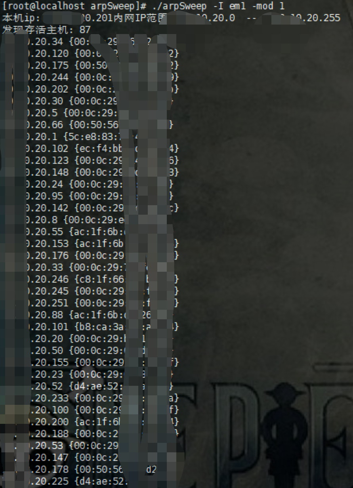
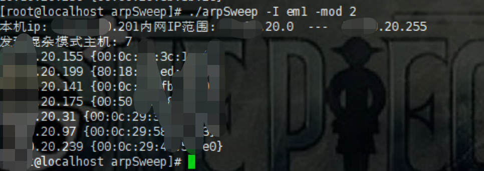

# arpSweep
使用arp探测内网存活主机

### 使用说明
```
[root@localhost arpSweep]# ./arpSweep -h
Usage of ./arpSweep:
  -I string
    	Network interface name
  -mod int
    	1 : 存活主机探测   2:混杂模式主机探测 (default 1)

```


### 存活主机扫描

<p align="center">
  <a  target="_blank">
    
  </a>
</p>

### 混杂模式主机扫描
<p align="center">
  <a  target="_blank">
    
  </a>
</p>